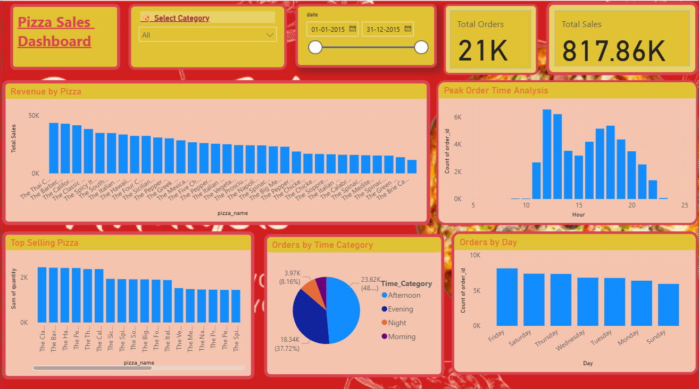

# 🍕 Pizza Sales Analysis Dashboard (Power BI)

## 📊 Project Overview

This project focuses on analyzing pizza sales data using Power BI to gain meaningful business insights. The dashboard helps understand customer ordering patterns, sales performance, and product trends.

---

## 🎯 Objectives

* Identify peak order times during the day
* Determine the busiest days for orders
* Find the most popular pizzas based on quantity
* Analyze revenue generated by each pizza
* Understand category-wise sales performance

---

## 📈 Key Insights

* Peak orders occur during lunch and evening hours
* Certain pizzas generate higher revenue despite lower quantity
* Weekends show higher order volumes
* Classic and Chicken categories contribute significantly to total sales

---

## 🛠 Tools & Technologies Used

* **Power BI** – Data Visualization
* **Power Query Editor** – Data Cleaning & Transformation
* **DAX (Data Analysis Expressions)** – Measures & Calculations
* **Data Modeling** – Relationship building between tables

---

## 📂 Dataset Details

The dataset consists of 4 tables:

* `orders` – Order date and time
* `order_details` – Order-wise pizza quantity
* `pizzas` – Pizza prices and sizes
* `pizza_types` – Pizza categories and ingredients

---

## ⚙️ Features of Dashboard

* Interactive visuals and charts
* KPI cards for Total Sales and Total Orders
* Slicers for filtering data by Date and Category
* Insights on time-based and category-based performance

---

## 📸 Dashboard Preview

---

## 🚀 How to Use

1. Download the `.pbix` file
2. Open in Power BI Desktop
3. Interact with slicers and visuals

---

## 📌 Conclusion

This project demonstrates how raw data can be transformed into actionable insights using Power BI. It highlights the importance of data visualization in business decision-making.

---

## 🔗 Connect with Me

([LinkedIn profile link here](https://www.linkedin.com/in/amruta-pawar-/))
